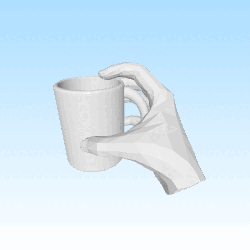
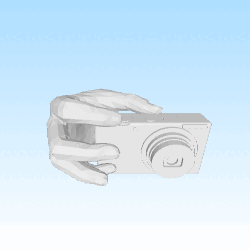
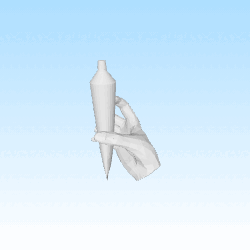
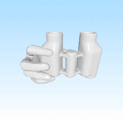
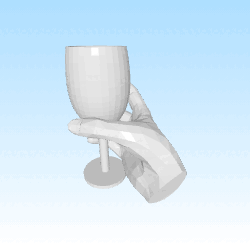
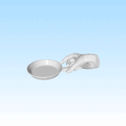
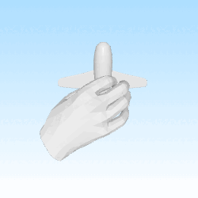
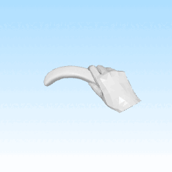
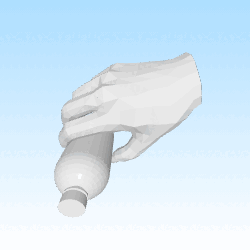

<p align="center">
  <h2 align="center">FastGrasp: Efficient Grasp Synthesis with Diffusion</h2>

<p align="center">
    <a href="https://wuxiaofei01.github.io/"><strong>Xiaofei Wu</strong></a>
    ·
    <strong>Tao Liu</strong>
    ·
    <strong>Caoji Li</strong>
    ·
    <strong>Yuexin Ma</strong>
    ·
    <strong>Yujiao Shi</strong>
    .
    <strong>Xuming He</strong>
  </p>
  <h3 align="center">3DV 2025</h3>

<p align="center">
    <a href="https://arxiv.org/abs/2411.14786">
      
    </a>
</p>

<p align="center">
  
  
  
</p>

<p align="center">
  
  
  
</p>

<p align="center">
  
  
  
</p>

This repo contains the training and evaluation of FastGrasp on OakInk-Shape , grab , HO-3D dataset.

## Table of content

- [Installation](#installation)
- [Data prepared](#data-prepared)
- [Evaluation](#evaluation)
- [Training](#training)

## Installation

Create a conda env from `environment.yml`:

```bash
conda env create -f environment.yml  
conda activate fast_grasp  
```

Install dependencies:

```bash
pip install -r requirements.txt
pip install -r requirements@git.txt
conda install -c conda-forge igl
git clone https://github.com/lixiny/manotorch.git
cd manotorch
pip install .
cd ..
git clone https://github.com/SLIDE-3D/SLIDE.git
cd SLIDE/pointnet2_ops_lib
pip install -e .
```

If you find that the installation of pytorch3d fails, please refer to the [link](https://github.com/facebookresearch/pytorch3d)

* maybe your cuda(nvcc) is not supported , 11.4 is in compliance with the version requirementsis

Get the [MANO hand model](https://mano.is.tue.mpg.de/):

```bash
cp -r {path_to}/mano_v1_2 ./assets
```

Download the pretrained model weights from [Huffing face](https://huggingface.co/datasets/wuxiaofei01/FastGrasp/tree/main)
and put the contents in `./checkpoints`.

## Data prepared

- install the [V-HACD](https://github.com/kmammou/v-hacd) for building the simulation of grasp displacement. you need change you path in [here](eval_ho3d.py#L153) and [here](./evaluation/displacement.py#L285) (must absolute path , The repository already contains testVHACD. If you have any problems, please try to install it yourself.)
- Download the processed GRAB dataset from [here](https://drive.google.com/file/d/1m85aiTGHpqqgQuF9NeQNE7VEEJ8V_aJ_/view) and unzip to current directory, like FastGrasp/grab_data
- Download the processed Oakink-shape dataset from [Huffing face](https://huggingface.co/datasets/wuxiaofei01/FastGrasp/tree/main) and unzip to FastGrasp/data/.
- Download HO-3D object models from [here](https://drive.google.com/file/d/1ZiEsq3NHXv6TPXr9TK8XbxywG_22631a/view), unzip and put into FastGrasp/dataset/HO3D_Object_models.

The file directory structure is as follows:

```
FastGrasp/
  assets/
    mano_v1_2/
  checkpoints/
    ae.pth
    diffusion.pth
    am.pth
  data/
    evaluation/
      obj_faces_test.npy
      obj_verts_test.npy
      ......
    precessed/
      hand_param_test.npy
      obj_pc_test.npy
      ......
  grab_data/
    sbj_info.npy
    ......
  dataset/
    HO3D_Object_models/
      003_cracker_box/
      ......
  testV-HACD
```
If you want to be able to process your own datasets, please refer to [here](data_preprocess.py). this file is used to preprocess the oakink dataset to speed up model training.


## Evaluation

### Evaluate grasp quality

The evaluation metrics include:


* Penetration Depth
* Penetration Volume
* Simulation Displacement
* contact_ratio
* entropy
* cluster_size

After executing the evaluation, the visualization results will be automatically saved in the same path as diffusion.pth. For the specific visualization code, please refer to [here](eval_ho3d.py#L127) and [here](eval_adapt.py#L172).


### Evaluation all pipeline
#### Grab dataset
```bash
python eval_adapt.py --config config/grab/eval_adapt.json  
```
#### Oakink dataset
```bash
python eval_adapt.py --config config/oakink/eval_adapt.json  
```
#### HO-3D dataset
```bash
python eval_ho3d.py --config config/grab/ho3d.json  
```
### Evaluation autoencoder module
####  Grab dataset
```bash
python eval_ae.py --config config/grab/eval_ae.json  
```
####  Oakink dataset
```bash
python eval_ae.py --config config/oakink/eval_ae.json  
```


* `guide_w`: Classifier weight
* `ddim_step`: ddim inference steps
* `penetr_vol_thre`and`simu_disp_thre` follow [GraspTTA](https://github.com/hwjiang1510/GraspTTA).

Please note that the pre-trained model uses checkpoints obtained from training on the GRAB dataset. Since simulation is required to calculate displacement, the evaluation time is dependent on the number of datasets used.

The evaluation times are as follows: 
1. HO3D takes approximately 5 minutes
2. GRAB takes around 6 minutes
3. OAKINK takes about 5 **hours**.


The evaluation results will be saved at `args.diffusion.path/`:
## Training

We first detail several `argparse` options

* `-config`: path to the config file.

For details please refer to [config.json](./config/oakink/ae.json).  Training checkpoints will be saved at `logs`.

It takes about **1 week** to fully train the entire pipeline, but since we have decoupled it into three parts, you can choose to use any pre-trained model and train your data directly. For example, use the AE, diffusion pre-trained module and only train the adapt module (represented as adapt layer in the code)

### Oakink-Dataset training
**Autoencoder** model on the OakInk-Shape `train` set:

```bash
# train autoencoder model 
python train_ae.py --config config/oakink/ae.json

# train diffusion model
python train_diffusion.py --config config/oakink/diffusion.json

# train adapt module
python train_adapt.py --config config/oakink/adapt.json
```
### Grab-Dataset training
**Autoencoder** model on the OakInk-Shape `train` set:

```bash
# train autoencoder model 
python train_ae.py --config config/grab/ae.json

# train diffusion model
python train_diffusion.py --config config/grab/diffusion.json

# train adapt module
python train_adapt.py --config config/grab/adapt.json
```
Please note that at different step stages, you need to use the checkpoints obtained from the **previous stage of training**.

You need to set the `file_name` in the json file, which is the path where your log file is saved

## Citation

If you find FastGrasp useful for your research, please considering cite us:

```bibtex
@inproceedings{Wu2024FastGraspEG,
  title={FastGrasp: Efficient Grasp Synthesis with Diffusion},
  author={Xiaofei Wu and Tao Liu and Caoji Li and Yuexin Ma and Yujiao Shi and Xuming He},
  year={2024},
  url={https://api.semanticscholar.org/CorpusID:274192568}
}
```
